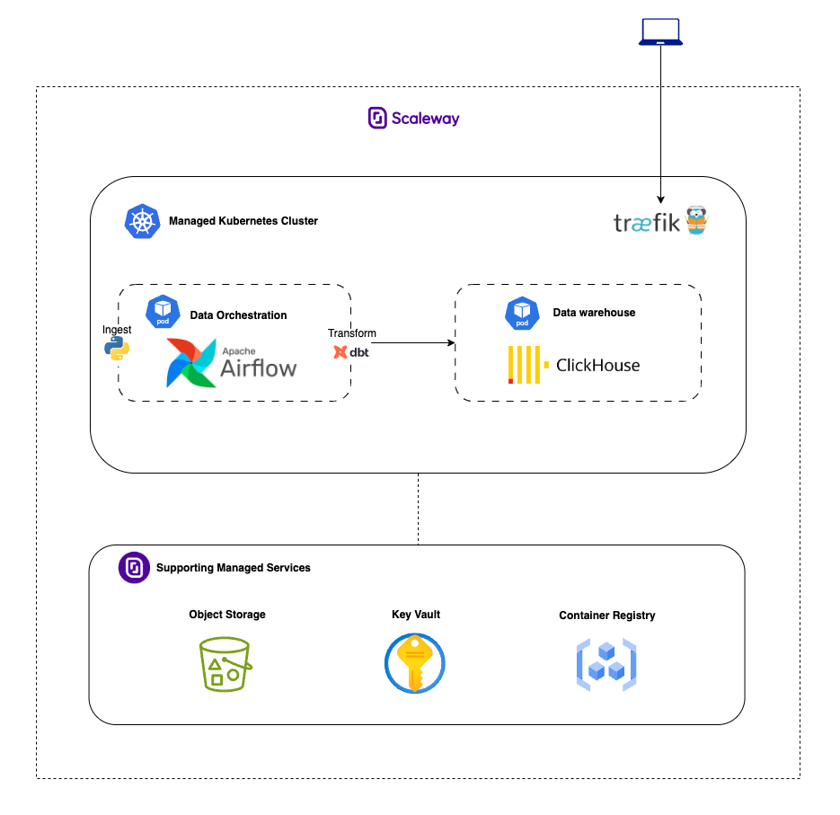

# Open source data warehouse 

This project is intended to implement a data pipeline as POC on an open source data warehouse stack. 
It serves as and alternative to the popular Big Tech Cloud Data Warehouses like Databricks, Snowflake, or BigQuery.

It uses the following open source components:

- Apache Airflow for orchestration
- ClickHouse for warehousing 
- dbt for data transformation

The project is designed to be deployed on [Scaleway](https://www.scaleway.com/en/) European Cloud infrastructure using Kubernetes and Terraform.

It uses the following Scaleway services:
- Kubernetes for container orchestration
- Object Storage for data storage
- Secrets Manager for managing sensitive information

> [IMPORTANT]  This project is a proof of concept and not intended for production use. It is meant to demonstrate the capabilities of an open source data warehouse stack.

## Architecture Overview



## Data Pipeline
The data pipeline example collects weather forecast data from a public API, processes it, and stores it in ClickHouse for further analysis. 

### Ingestion
The pipeline consists of the following components:
- **Weather Data Collector**: Python service that fetches weather forecasts from a public API
- **Ingestion Layer**: Classes that handle data extraction and loading into S3 storage
- **Storage Client**: Manages interaction with Scaleway Object Storage for raw data persistence
- **ClickHouse Client**: Handles connections and data writing to ClickHouse
- **Airflow DAG**: Orchestrates the entire pipeline with scheduled execution

The `src/` directory contains all Python source code for the data pipeline:

- `data_pipeline/`: Root package for all pipeline components
  - `ingestion/`: Data ingestion services
    - `weather_data_collector.py`: Core module for retrieving weather forecasts
    - `clients/`: API clients for external services
      - `weather.py`: Client for the weather forecast API
      - `storage.py`: Client for S3-compatible object storage
      - `clickhouse.py`: Client for ClickHouse database operations
      - `base.py`: Base client classes and interfaces
    - `models/`: Data models for pipeline entities
      - `location.py`: Represents geographical locations for weather data
      - `scaleway_storage.py`: Models for interacting with cloud storage
      - `clickhouse.py`: Data structures for ClickHouse integration
    - `configs/`: Configuration settings and constants
    - `data/`: Static data files (e.g., dutch_cities.txt)
    - `utils/`: Helper functions and utilities

The pipeline uses Airflow for orchestration, with DAGs defined in the `dags/` directory. Weather data is first collected and stored as raw JSON in Scaleway Object Storage before being processed and loaded into ClickHouse using the dbt models described in the next section.

### Transformation
The project uses dbt (data build tool) to transform raw weather data into structured, analytics-ready datasets following a layered approach:

#### Raw Layer
- **raw_weather**: Ingests JSON weather data directly from S3 storage, preserving the raw content and adding a load timestamp. This model uses ClickHouse's native S3 functions to read data from the object storage bucket.

#### Staging Layer
- **stg_weather**: Transforms raw JSON data into a structured format by extracting specific weather attributes such as temperature, precipitation, and wind speed. This incremental model processes only new data since the last run, extracts city information, coordinates, and hourly weather metrics.

#### Mart Layer
- **mart_daily_weather_summary**: Provides aggregated daily weather statistics by city. This model calculates min/max/avg temperatures, wind speeds, and precipitation totals to support analytics use cases.

## Project Structure

- `dags/`: Airflow DAGs for weather data collection
- `dbt/`: Data transformation models using dbt
- `k8s/`: Kubernetes configuration for deployment - see [K8s README](k8s/README.md)
- `src/`: Python source code for the data pipeline
- `terraform/`: Infrastructure as code for Scaleway setup - see [Terraform README](terraform/README.md)

## Local Development

### Prerequisites

- Python 3.11 or later
- Docker and Docker Compose
- UV package manager

### Setup

Clone the repository:

```bash
git clone <repository-url>
cd open-source-data-warehouse-poc
```

## Deployment 

For deployment of the open source warehouse, we use Scaleway's infrastructure with Kubernetes and Terraform.

### Quick Start

1. **Infrastructure**: Deploy cloud resources with Terraform - see [Terraform README](terraform/README.md)
2. **Kubernetes**: Deploy applications on K8s cluster - see [K8s README](k8s/README.md)

### Prerequisites

- Scaleway CLI installed and configured
- Terraform installed
- kubectl installed
- Helm v3.x installed
- Docker installed

## Running the Pipeline

The weather data collection pipeline runs on a schedule defined in the Airflow DAG. You can also trigger it manually from the Airflow UI.

## Data Transformation

dbt models are used for transforming the raw weather data into useful analytics tables. To run the dbt models:

```bash
cd dbt
dbt run
```

## Production Guidelines
The project is a proof of concept and not intended for production use. However, if you plan to build from here, consider the following improvements:

Generic improvements
- Separate infrastructure, k8s manifests, ingestion and transformation code into different repositories.
- Re-evaluate secret management strategy, possibly using an external secrets manager with [helm secrets plugin](https://github.com/jkroepke/helm-secrets).
- Use artifact registry for ingestion Python code .

Airflow improvements
- Check production guidelines - [Airflow Production Guidelines](https://airflow.apache.org/docs/helm-chart/stable/production-guide.html).
- Use managed Postgres as Airflow metastore.
- Sync dags from Git repo instead of building them into the Docker image.
- Store logs in Scaleway Object Storage.
- Add Redis for caching and task queue.

ClickHouse improvements
- Adjust computation resources based on workload requirements.
- Add ClickHouse 3rd party interface for better user experience - [options](https://clickhouse.com/docs/interfaces/third-party)

Additional components
- Add ArgoCD for continuous deployment and monitoring of deployments.
- Add open-source catalog such as unity or LakeKeeper for governance and discovery.